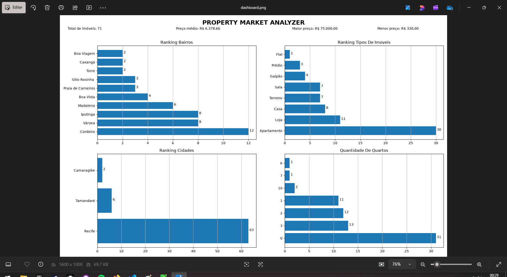
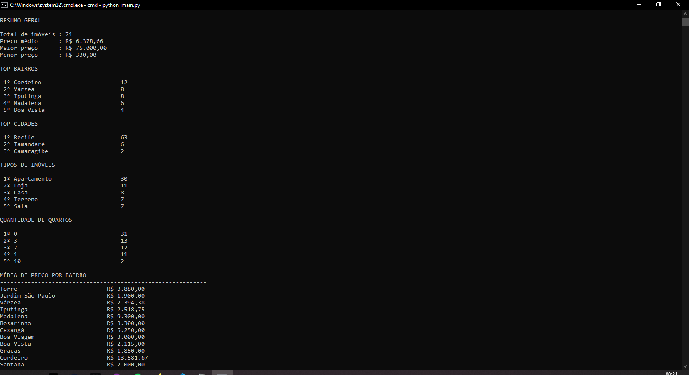
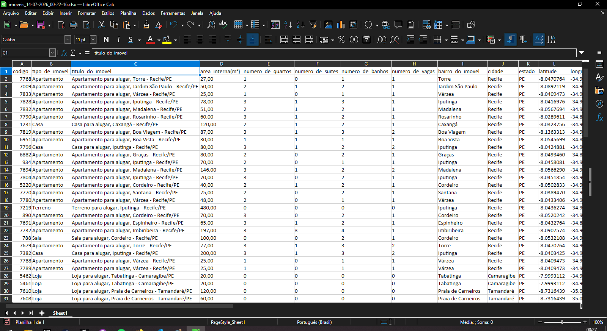

# Property Market Analyzer

A Python-based real estate market data analysis tool.

The project automatically collects property listings through the CTI Imobiliária API, processes the data, performs statistical analysis, generates rankings, exports reports in multiple formats, and provides a dashboard with visual insights.

## Dashboard



## Terminal Summary



## Data Exports



## Features

* Automatic property data collection through an API
* Automatic pagination
* Error handling during data collection
* Modular application structure
* Statistical analysis of property data
* Neighborhood rankings
* City rankings
* Property type rankings
* Bedroom count rankings
* JSON export
* CSV export
* Excel export
* Data visualization dashboard
* Terminal summary

## Tech Stack

* **Python**
* **Requests** for API communication
* **Pandas** for data processing and analysis
* **Matplotlib** for data visualization
* **JSON** for structured data export

## Application Flow

```text
CTI API
   │
   ▼
Scraper
   │
   ▼
Analyzer
   │
   ├── Terminal
   ├── Dashboard
   └── Data Exports
```

## Running Locally

```bash
git clone https://github.com/robertob-data/Property-Market-Analyzer.git
cd Property-Market-Analyzer
pip install -r requirements.txt
python main.py
```

## Generated Results

After execution, the application generates:

* Dashboard image (`.png`)
* Excel report (`.xlsx`)
* CSV file
* JSON file
* Statistical summary in the terminal

## Author

**Roberto Batista Dias**

Python Developer
